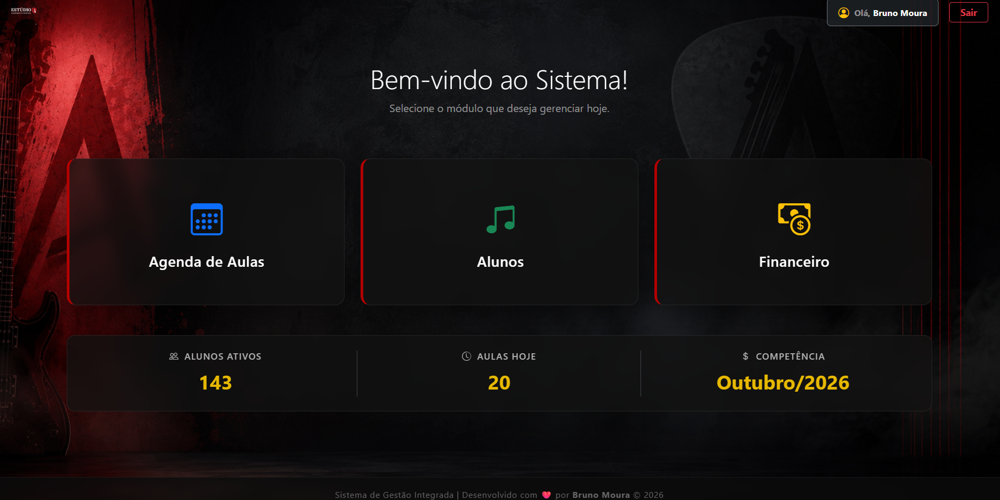
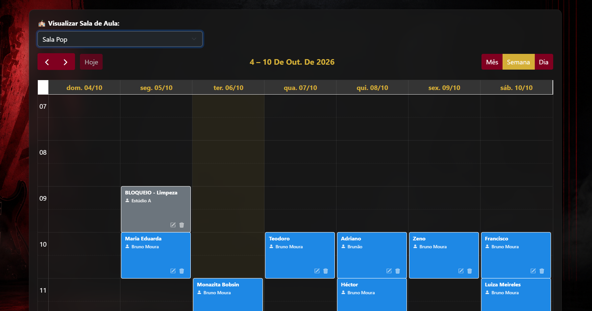
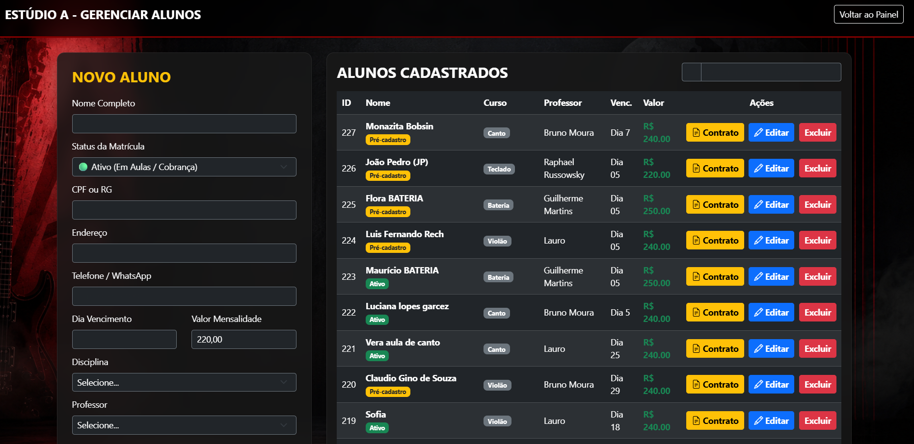
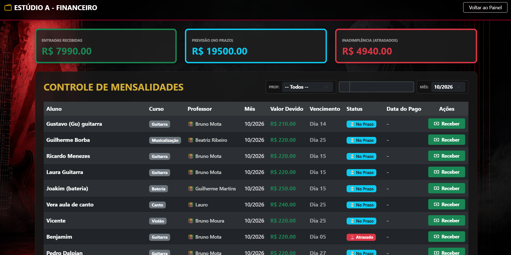
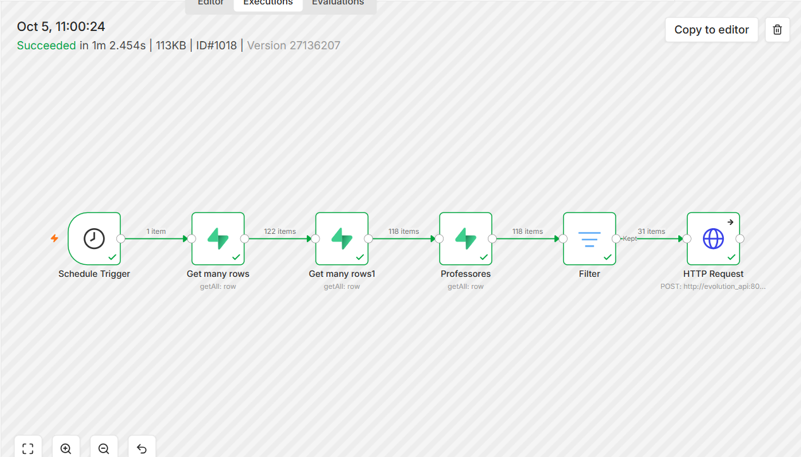
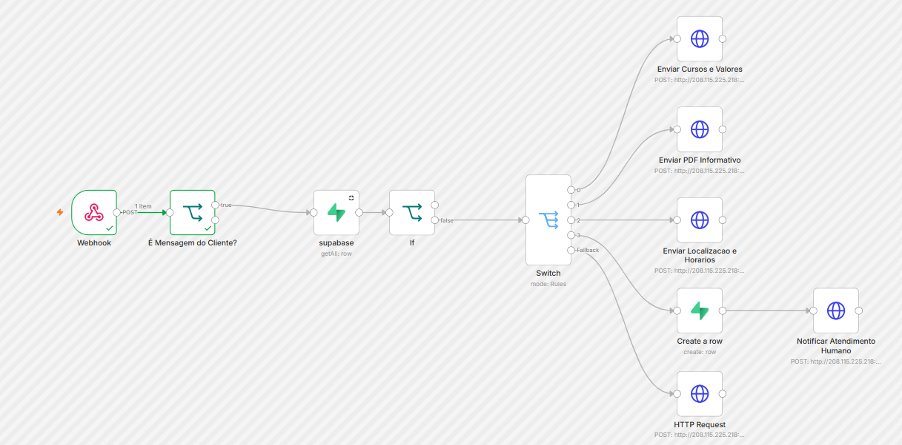

# Music School Manager 🎵🚀


O **Music School Manager** é uma plataforma integrada de ERP, gestão pedagógica e automação de mensageria desenvolvida sob medida para escolas de música (em produção no *Estúdio A*). A solução centraliza o controlo de matrículas, agenda dinâmica de salas por grade semanal, auditoria contábil com histórico de competências e uma esteira automatizada de atendimento e cobrança via WhatsApp utilizando n8n e Evolution API.

---

## 📸 Demonstração do Sistema

### 1. Painel Principal & Indicadores Rápidos
> Hub de navegação rápida com contadores dinâmicos de alunos ativos, total de aulas do dia sincronizadas em tempo real e competência contábil ativa.
<p align="center">
  
</p>

### 2. Agenda Inteligente & Gestão de Salas
> Grade semanal de horários com filtros por sala de aula, bloqueios administrativos (ex.: manutenção e limpeza), vinculação de docentes e regras dinâmicas de exibição.
<p align="center">
  
</p>

### 3. Matrículas & Gestão de Alunos
> Registo completo de estudantes, definição de modalidades, vínculo de docentes, regras de vencimento, estados financeiro/pedagógico e emissão dinâmica de contratos.
<p align="center">
  
</p>

### 4. Módulo Financeiro & Controlo de Mensalidades
> Painel de fluxo de caixa com consolidação de entradas, previsões no prazo, monitorização de inadimplência e gestão de cobranças por competência.
<p align="center">
  
</p>

---

## 🤖 Automações com n8n & WhatsApp

### Régua de Cobrança Ativa (Batch Processing)
Rotina agendada via Cron que consulta a base no Supabase, processa lotes completos de mensalidades pendentes sem truncamento, compara vencimentos com a data corrente e dispara lembretes personalizados de pagamento via Evolution API.
<p align="center">
  
</p>

### Chatbot de Triagem & Atendimento Receptivo
Webhook integrado que captura mensagens recebidas, filtra eventos do sistema e reações com validação booleana, consulta dados cadastrais no Supabase e ramifica o atendimento (cursos, tabela de valores, informativos em PDF, horários ou notificação para atendimento humano).
<p align="center">
  
</p>

---

## 🔥 Funcionalidades Técnicas

* **Processamento Completo de Lotes (Supabase + n8n):** Estrutura de consulta contínua (`Return All`) configurada para evitar paginações estáticas e garantir a leitura integral das mensalidades ativas.
* **Sincronização Temporal Estrita:** Normalização explícita para o fuso horário oficial de Brasília (`America/Sao_Paulo` / UTC-3), impedindo inconsistências na contagem de aulas na dashboard antes da meia-noite.
* **Controlo de Acesso Baseado em Perfis (RBAC):** Isolamento de permissões entre a administração escolar (gestão global de faturamento e turmas) e painel restrito por docente (visualização apenas de horários e alunos próprios).
* **Segurança e Criptografia:** Armazenamento protegido de senhas através do algoritmo Scrypt (`werkzeug.security`) associado a gestão segura de sessões HTTP.
* **Emissão Dinâmica de Contratos:** Geração automatizada de termos de prestação de serviços com folhas de estilo configuradas para impressão limpa e exportação direta em PDF.

---

## 🛠️ Tecnologias Utilizadas

* **Backend:** Python 3.10+, Flask
* **Banco de Dados & Nuvem:** PostgreSQL (hospedado via Supabase) / MySQL
* **Automação de Processos:** n8n (Webhooks, Agendamentos Cron, Filtros e Manipulação JSON)
* **Gateway de Mensageria:** Evolution API (Integração WhatsApp Business)
* **Frontend:** HTML5, CSS3, JavaScript, Jinja2 e Bootstrap 5.3 (Tema Escuro Corporativo)
* **Segurança:** Werkzeug Security (Scrypt Hashing) & Flask Sessions

---

## 🚀 Como Executar o Projeto Localmente

### 1. Clonar o Repositório
```bash
git clone [https://github.com/SEU_USUARIO/music-school-manager.git](https://github.com/SEU_USUARIO/music-school-manager.git)
cd music-school-manager
